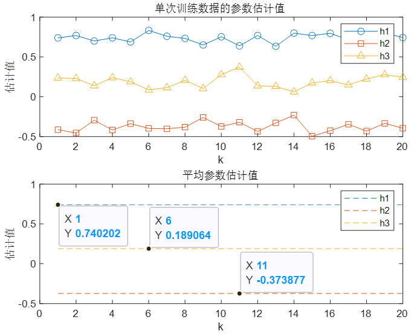

# LS Algorithm for Channel Estimation in Digital Mobile Communication

## Overview
This repository focuses on using the Least Squares (LS) algorithm, a classic method in channel estimation, to solve a practical problem in digital mobile communication systems. The goal is to estimate channel parameters using the Monte Carlo simulation method and visualize the estimation results.

## Problem Description
In a digital mobile communication system, the receiver receives a Bernoulli sequence signal ${{x_n}}$ with equal probability values of $\pm 1$, where $n$ is the symbol period index. The multi-path channel response from the transmitter to the receiver is given by $h\left( n \right) = 0.75\delta \left( n \right) - 0.42\delta \left( {{n - 1}} \right) + 0.21\delta \left( {{n - 3}} \right)$. The received signal is time-synchronized with the transmitted signal and is corrupted by independent additive white Gaussian noise ${{w_n}}$ with a mean of $0$ and a variance of $0.01$.

## Simulation Settings
- **Data Length**: $N = 200$
- **Data Vector Length**: $L = 10$
- **Number of Data Vectors**: $K = N/L$

## Tasks
1. **Channel Parameter Estimation**: Use the LS algorithm to estimate channel parameters for each data vector $k = 1,2, \cdots,K$.
2. **Monte Carlo Simulation**: Conduct 100 independent random training data simulations.
3. **Result Presentation**: Provide the parameter estimation values for single-training data and the average estimation values for 100 independent random training data.
4. **Visualization**: Plot the estimation results against the index $k = 1,2, \cdots,K$ to show the change curves of the estimation values.

## How to Use
The code in this repository is designed to perform the above tasks. You can run the main script to start the simulation and obtain the estimation results and plots.

## Dependencies
- MATLAB (Recommended version: 2024a)
